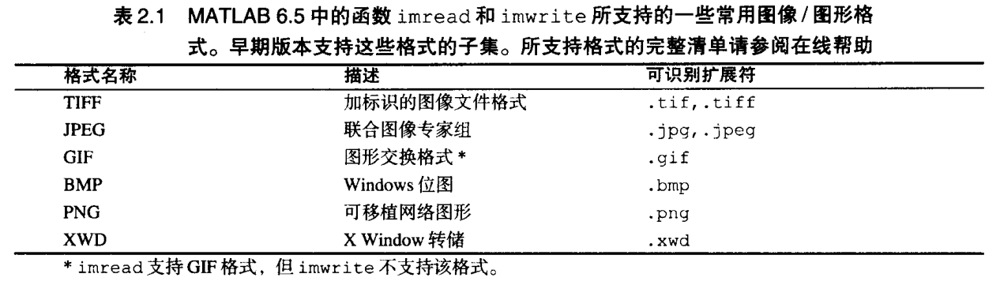

# 第一章 绪论    
使用MATLAB图像处理工具箱IPT函数，并且本书开发了新函数，每个函数的源代码包含在各章节或附录C中      
# 第二章 基本原理         
## Matlab支持图片格式    
        
## 图像操作    
1.读取图像：`f=imread('xxxx.jpg')`    
2.读取行列：`[m,n]=size(f)`, `whos f`显示数组附加信息。第一维表示垂直方向，`size(f,1)`表示行数   
3.显示图像：`imshow(f,G)`  若将G省略，默认灰度级数为256；`G=[low high]`表示low以下为黑，high以上为白；`G=[ ]`表示low默认为f中最小值，high为最大值   
4.函数pixval：交互显示单个像素亮度值；若按住鼠标左键不放，可用于测量距离  
5.保存图像：`imwrite(f,'xxxx.jpg')`  
* JPEG压缩：`imwrite(f,'xxx.jpg','quality',q)`  q为0-100的整数，q越小图像退化越严重      
* 可用imfinfo计算压缩率       

```
K=imfinfo('test.jpg');   
image_bytes = K.Width*K.Height*K.BitDepth/8;   
compressed_bytes = K.FileSize;   
compressed_ratio = image_bytes/compressed_bytes;   
```       

K结构体成员如下图   
      
* tif同分辨率尺寸缩放      

## 数据类         
     

## 图像类型        
* 亮度图像（Intensity images）     
* 二值图像（Binary images）：数据类为logical。A为由0、1构成的数值数组，`B=logical（A）`，islogical判断    
* 索引图像（Indexed images）   
* RGB图像（RGB images）    

## 数据类与图像数据类型间的转换      
* 数据类转换：B=logical（A）或uint8(A); double转uint8，会将[0 255]以外去掉，然后去掉小数点部分   
* 图像类型转换：   
    - im2uint8：[0 1]范围内乘255，范围外置为0,1。   
    - im2uint16：与int8类似，65535。   
    - mat2gray：只能输入double，转换为[0 1]的double；mat2gray(A,[Amin,Amax])规定转换后的0,1。   
    - im2double：若输入为uint8，每个值除以255；若为uint16，除以65535。   
    - im2bw：`im2bw(f,T)`T的取值为[0 1]；若输入uint8，会先每个值除以255；可以用关系运算'gb=f>2'替代。    

## 数组索引   
* 向量索引：v([1 4 7])   
* 矩阵索引：   
1.A(D),D为逻辑数组，将所有为1的以列向量排列   
2.一个：，将全部元素以逐列形式排成一个列向量，sum(A(:))等价于sum(sum(A))    
### 例2.5      
* 垂直翻转`fp=f(end:-1:1,:);`    
* 二次取样`fs=f(1:2:end,1:2:end);`    

## 标准数组     
   
## 运算符    
1.算数运算符   
    
* max&min    
    
2.关系运算符 ~=    
3.逻辑运算符 & | ~    


   

## 代码优化   
* tic toc 计时；t1/(t2+eps)   
* 预分配数组   

## 单元数组与结构体   
```
//单位数组
c={'guess',[1;2],3}
c{1}
```
```
//结构体
field='first';
value=1;
c=struct(field,value);
```
