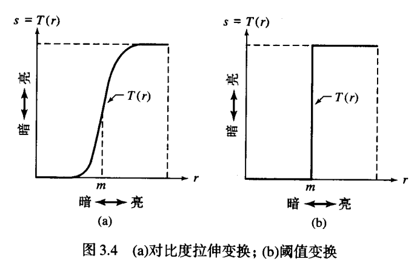

# gamma变换
* 数学原理    
    幂等变换:$I=cI^\gamma$     
    
* MATLAB   
    ```
    g=imadjust(f,[low_in high_in],[low_out high_out],gamma)    
    %[]默认[0 1];若low_out>high_out,亮度反转    
    %gamma>1,曲线上弯，变亮，从而进行对比度增强；gamma<1,曲线下弯，变暗，从而进行灰度级压缩。
    ```
* python
    ```python
    #自己编的函数复现MATLAB的imadjust函数,
    # img_mono单通道图像，[low_in,high_in]到[0,1]映射，out_inverse=1时为到[1,0]的映射
    def imadjust(img_mono, gamma, low_in=0, high_in=255, out_inverse=0):
      # img_mono单通道图像，[low_in,high_in]到[0,1]映射，out_inverse=1时为到[1,0]的映射
      # 将[low_in,high_in]以外值减掉，向量化
      image_trunc = (img_mono > high_in) * high_in + (img_mono <= high_in) * img_mono
      image_trunc = (image_trunc < low_in) * low_in + (image_trunc >= low_in) * image_trunc
      # 归一化0-1
      img_adjust = (image_trunc - image_trunc.min()) / float(image_trunc.max() - image_trunc.min())
      # 反转
      if out_inverse == 1:
            img_adjust = 1 - img_adjust
      # gamma变换
      img_adjust = (img_adjust**gamma)*255
      #！！此处有问题！！，img_adjust为浮点型0-255.0，imshow会显示不正常
      return img_adjust

    #skimage
    import cv2
    from skimage import exposure
    img = cv2.imread('1.jpg')
    gamma_img = exposure.adjust_gamma(img, gamma)
    #skimage像素值拉伸。若image为uint8类型，[min,max]映射到[0,255];若为float，映射到[0,1.0]
    exposure.rescale_intensity(image)
    ```          
# 对数与对比度拉伸
* 数学原理
    - 对数变换（压缩高动态范围）：$log(1+f)$，$10^6$可被压缩到14
    
    - 对比度拉伸变换：$\frac{1}{(1+(m/I)^E)}$，m为灰度控制点，E控制斜率
    
    
* MATLAB
    ```
    %压缩高动态范围
    in2uint8(mat2gray(log(1+double(f))))
    %对比度拉伸变换，eps防止分母为0导致溢出
    1./(1+(m./(double(f)+eps)).^E)
    #m=mean2(f),取平均值
    ```
* python
    ```python
    #log-skimage
    from skimage import ecposure
    gam1= exposure.adjust_log(image) 
    #adjust_log(image, gain=1, inv=False)
    #该函数在将每个像素缩放到0到1范围之后，根据方程O=gain∗log(1+I)变换输入图像像素，对于逆对数校正，该方程为O=gain∗(2^I−1)
    ```
    ```python
    #对比度增强-PIL
    from PIL import Image
    from PIL import ImageEnhance
    #原始图像
    image = Image.open('lena.jpg')
    image.show()
    #亮度增强
    enh_bri = ImageEnhance.Brightness(image)
    brightness = 1.5
    image_brightened = enh_bri.enhance(brightness)
    #色度增强
    enh_col = ImageEnhance.Color(image)
    color = 1.5
    image_colored = enh_col.enhance(color) 
    #对比度增强
    enh_con = ImageEnhance.Contrast(image)
    contrast = 1.5
    image_contrasted = enh_con.enhance(contrast)
    #锐度增强
    enh_sha = ImageEnhance.Sharpness(image)
    sharpness = 3.0
    image_sharped = enh_sha.enhance(sharpness)
    ```
# 直方图绘制，直方图均衡化，直方图匹配
## 绘制直方图
* MATLAB
    ```
    #介绍
    h = imhist(f, b) %b为灰度级个数，h(1),h(2)...代表各灰度级像素点个数
    h = imhist(f, b)/numel(f) %numel(f)代表f像素点个数
    bar(horz, v, width) #horz与v相同维度，width默认为0.8
    stem(horz, v, 'color_linestyle_marker', 'fill')
    ```
    
    ```
    #绘制条形直方图案例
    h= imhist(f)
    h1= h(1:10:256) %10个灰度级为一组
    horz = 1:10:256
    bar(horz, h1)
    axis([0 255 0 15000])
    set(gca, 'xtick', 0:50:255)  #设置刻度
    set(gca, 'ytick', 0:2000:15000)  #设置刻度
    xlabel('text string', 'frontsize', size)
    ylabel('text string', 'frontsize', size)
    text(xloc，yloc,'textstring', 'frontsize', size) %xloc,yloc为文字起始位置
    title('titlestring')
    #绘制杆状直方图, 也可plot
    h= imhist(f)
    h1= h(1:10:256) %10个灰度级为一组
    horz = 1:10:256
    stem(horz, h1, 'fill')
    axis([0 255 0 15000])
    set(gca, 'xtick', 0:50:255)  #设置刻度
    set(gca, 'ytick', 0:2000:15000)  #设置刻度
    ```
    ```python
    #将灰度数组映射为直方图字典,nums表示灰度的数量级
    def arrayToHist(grayArray, nums):
        w,h = grayArray.shape
        hist = {}
        for k in range(nums):
          hist[k] = 0
        for i in range(w):
          for j in range(h):
            if hist.get(grayArray[i][j]) is None:
                hist[grayArray[i][j]] = 0
            hist[grayArray[i][j]] += 1
        #normalize
        n = w*h
        for key in hist.keys():
            hist[key] = float(hist[key])/n
        return hist
    #绘制直方图，传入的直方图要求是个字典，每个灰度对应着概率
    def drawHist(hist,name):
        keys = hist.keys()
        values = hist.values()
        x_size = len(hist)-1#x轴长度，也就是灰度级别
        axis_params = []
        axis_params.append(0)
        axis_params.append(x_size)
        plt.figure()
        if name != None:
           plt.title(name)
        plt.bar(tuple(keys),tuple(values))#绘制直方图
        plt.show()
    ```
## 直方图均衡化
灰度级均衡化处理的最终结果是一幅**扩展了动态范围**的图像，有较高的对比度
* 数学原理
    - 建立原图像到均衡化图像的灰度级（亮度值）映射，使均衡化图像灰度级概率密度函数PDF为常数
    $s\epsilon[0,1]$为映射后的灰度级，r为原图像灰度级
    $$s=T(r)=\int_0^r p_r(w) \,{\rm d}w$$
    - 证明：映射后PDF为常数
    映射前后各灰度级像素个数不变，即$p_s(s)=p_r(r)\mid\frac{{\rm d}r}{{\rm d}s}\mid$
    
    $$p_s(s)=p_r(r)\mid\frac{{\rm d}r}{{\rm d}s}\mid=p_r(r) \mid \frac{{\rm d}r}{{\rm d}T(r)}\mid$$
    $$=p_r(r)|\frac{{\rm d}}{{\rm d}T(r)} \int_0^r p_r(w) \,{\rm d}w |=1$$
    
    - 对于离散值$p_r(r_k)=\frac{n_k}{n}$
    $$s_k=T(r_k)=\sum_{j=0}^k p_r(r_j)=\sum_{j=0}^k \frac{n_j}{n} $$
    $$k=0,1,2,...,L-1$$
* MATLAB 
    ```
        g=histeq(f, nlev) %nlev为输出图像的灰度级数
    ```
    ```  
        %绘制映射函数
        hnorm= imhist(f)./numel(f)
        cdf= cumsum(hnrom)
        x= linespace(0,1,256)
        plot(x, cdf)
    ```
* python
    ```python
    #计算累计直方图计算出新的均衡化的图片，h_s为计算好的直方图灰度级数组,nums为灰度数,256
    def equalization(grayArray, h_s,nums):
        #计算累计直方图
        tmp = 0.0
        h_acc = h_s.copy()
        for i in range(256):
           tmp += h_s[i]
           h_acc[i] = tmp
        if len(grayArray.shape) != 2:
           print("length error")
           return None
        w,h = grayArray.shape
        des = np.zeros((w,h),dtype = np.uint8)
        for i in range(w):
           for j in range(h):
               des[i][j] = int((nums - 1)* h_acc[grayArray[i][j] ] +0.5)
        return des
    ```
## 直方图匹配 
当累计变换函数非常陡，即灰度级过于集中，直方图均衡化将失效；直方图匹配的结果则是我们指定的直方图，由于原始图像的累计直方图和我们指定的输出图片的直方图的累计直方图不可能完全相同，所以匹配结果并非百分之百的匹配。
* 数学原理
    使两个累积概率函数尽可能相似
* MATLAB
    ``` 
    g= histeq(f, hspec)  %hspec为指定的直方图；当hspec灰度级数远小于f中时，能较好的匹配
    %双峰值高斯函数模拟直方图,A为双峰权值;k用于提高直方图下限
    function p= two_mode_gauss(m1, sig1, m2, sig2, A1, A2, k)
    c1= A1 * (1/((2*pi)^0.5)*sig1)
    k1= 2* sig1^2
    c2= A2 * (1/((2*pi)^0.5)*sig2)
    k2= 2* sig2^2
    z= linspace(0,256,256)
    p= k+ c1*exp(-((z-m1).^2)./k1) + c2*exp(-((z-m2).^2)./k2)
    p= p./sum(p(:))
    ```
* python
    ```python
    #直方图匹配函数，接受原始图像grayArray和目标灰度直方图h_d
    def histMatch(grayArray,h_d):
        #计算累计直方图
        tmp = 0.0
        h_acc = h_d.copy()
        for i in range(256):
            tmp += h_d[i]
            h_acc[i] = tmp
        h1 = arrayToHist(grayArray,256)
        tmp = 0.0
        h1_acc = h1.copy()
        for i in range(256):
            tmp += h1[i]
            h1_acc[i] = tmp
        #计算映射
        M = np.zeros(256)
        for i in range(256):
            idx = 0
            minv = 1
            for j in h_acc:
                if  np.fabs(h_acc[j] - h1_acc[i]) < minv:
                   minv = np.fabs(h_acc[j] - h1_acc[i])
                   idx = int(j)
            M[i] = idx
        des = M[grayArray]
        return des
    ```
# 空间滤波
## 线性滤波
Q：相关与卷积？？有什么案例能说明，二者对试验结果的影响？
* MATLAB
    - 生成滤波器
    `w = fspecial('type', parameters)`
    
    
    - 滤波，w为掩膜,w=[1 1 1; 1 -8 1; 1 1 1]
    `g=imfilter(f, w, filtering_mode， boundary_option, size_option)`
          
* python
    ```python
    #用到再去找
    #blur—图像均值平滑滤波src：图像矩阵；ksize：滤波窗口尺寸
    cv2.blur(src, ksize, dst=None, anchor=None, borderType=None)
    #GaussianBlur—图像高斯平滑滤波;src：图像矩阵;ksize：滤波窗口尺寸;sigmaX：标准差
    cv2.GaussianBlur(src, ksize, sigmaX, dst=None, sigmaY=None, borderType=None)
    #laplace
    kernel = np.array([[0, -1, 0], [-1, 5, -1], [0, -1, 0]], np.float32)
    dst = cv2.filter2D(img, -1, kernel=kernel)
    #Sobel函数
    cv2.Sobel(src, ddepth, dx, dy, dst=None, ksize=None, scale=None, delta=None, borderType=None)
    #前四个是必须的参数：src是需要处理的图像；ddepth是图像的深度，-1表示采用的是与原图像相同的深度。目标图像的深度必须大于等于原图像的深度；第三和第四：dx和dy表示的是求导的阶数，0表示这个方向上没有求导，一般为0、1、2。
    ```
## 非线性滤波
* MATLAB    
    - 最佳选择colfilt    
    colfilt占用更多内存，但比nlfilter快得多。
    - 填充函数padarray
    
    - ordfilt2生成统计排序滤波器
* python
    ```python
    #medianBlur—图像中值滤波;src：图像矩阵;ksize：滤波窗口尺寸
    cv2.medianBlur(src, ksize, dst=None)
    ```

    
