# 彩色图像处理    
## 索引图像
* 概念     
一幅索引图包含一个数据矩阵data和一个调色板矩阵map，数据矩阵可以是uint8，uint16或双精度类型的，而调色板矩阵则总是一个m×3的双精度矩阵
索引图像相比彩色图像，文件更小，主要用于网络上的图片传输和一些对图像像素、大小等有严格要求的地方     
`imshow(X, copper)`,copper为MATLAB内置彩色映射
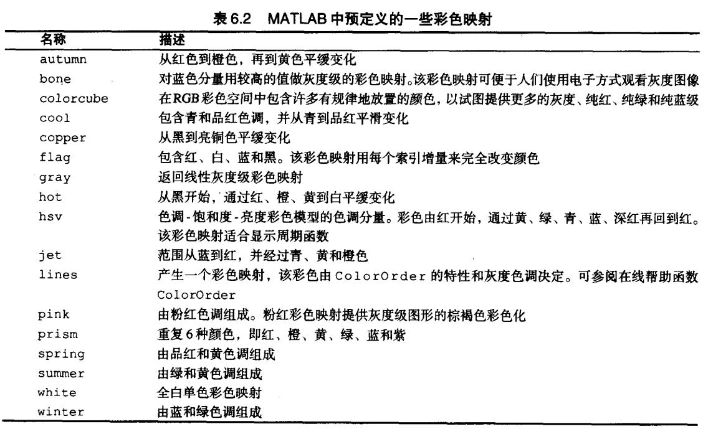     
* 图像“抖动”（用黑白二值图产生灰色调）   
    `bw= dither(gray_img)`%灰度图转换为二值“抖动”图    
    `rgb2ind`对减少RGB图像的色彩数很有用   
    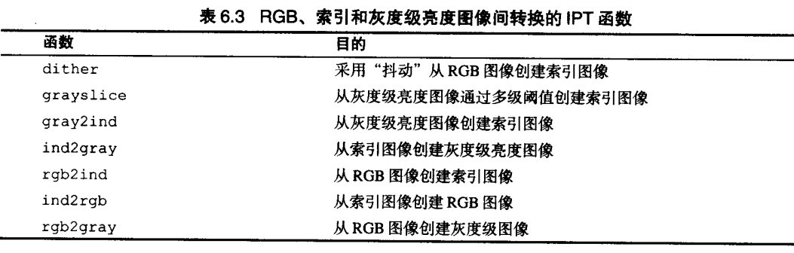
    
## 图像基本操作
* 分离通道&合并通道     
    - MATLAB       
     
    ```     
    rgb_img= cat(3, fR, fG, fB)       
    fR = rgb_img(:,:,1)     
    fG = rgb_img(:,:,2)     
    fB = rgb_img(:,:,3)     
    %rgbcube(vx,vy,vz),绘制彩色立方体    
    ```    
    - python   
           
    ```python
    B,G,R = cv2.split(image)       
    img = cv2.merge([B,G,R]) 
    ```          
* 色彩空间转换     
    - 颜色空间类型     
    NTSC，YCbCr，HSV，CMYK，HSI    
    - MATLAB  
      
    ```    
    hsv_img= rgb2hsv(rgb_img)   
    rgb_img= hsv2rgb(hsv_img)   
    cmy_img= imcomplement(rgb_img)   
    rgb_img= imcomplement(cmy_img)   
    ```
    - python   
    
    ```python
    #skimage
    skimage.color.rgb2grey(rgb)
    skimage.color.rgb2hsv(rgb)
    skimage.color.rgb2lab(rgb)
    skimage.color.gray2rgb(image)
    skimage.color.hsv2rgb(hsv)
    skimage.color.lab2rgb(lab)
    #opencv
    cv2.cvtColor(input_image,flag)
    #flag:cv2.COLOR_BGR2GRAY, cv2.COLOR_BGR2HSV....
    ```     
    
## 彩色变换
* 生成映射函数
    - `z=interplq(x,y,xi)`:`z=interplq([0 255]' [0 255]' [0:255]')` 
    - `z=spline(x,y,xi)` :若y比x多两个元素，则第一个和最后一个被假定为三次样条的端滚降
    - `g=ice('image',f,'space','hsi')`：鼠标控制映射曲线 
    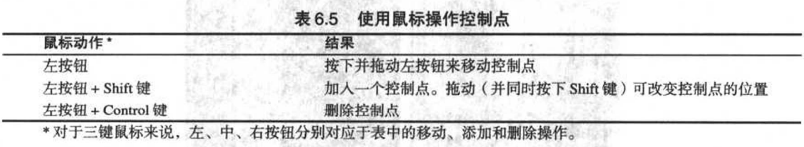
* 彩色图均衡化      
    RGB分量分别均衡化会导致错误的色彩，转换为HSI后，H不动（色调保持不变），S、I进行均衡化。
    
## 彩色图像空间滤波
* 平滑-在RGB独立分量上同时进行
    ``` 
    %MATLAB
    w=fspecial('average',25)
    I_filter=imfilter(I,w,'replicate')
    ```
* 锐化-在RGB独立分量上同时进行
    ``` 
    %MATLAB
    mask=[1 1 1;1 -8 1;1 1 1]
    fen=imsubstract(fb,imfilter(fb,mask,'replicate'))
    ```
    
## RGB向量空间直接处理      
基于单独彩色平面的处理不等于直接在RGB向量空间中处理
* 使用梯度的彩色边缘检测
    - 灰度图像梯度      
    
    二维函数$f(x,y)$的梯度向量为$\nabla f= [G_x G_y]^T=[\frac{\partial f}{\partial x} \frac{\partial f}{\partial y}]^T$
    梯度向量幅值为$mag(\nabla f)=[{G_x}^2+{G_y}^2]^{1/2}=[{\frac{\partial f}{\partial x}}^2+{\frac{\partial f}{\partial y}}^2]^{1/2}$
    使用近似值避免平方与开平方运算（幅度与变化程度成比例）$ mag(\nabla f) \approx|G_x|+|G_y|$。      
    $G_x$等导数用邻域内的像素值差来计算
    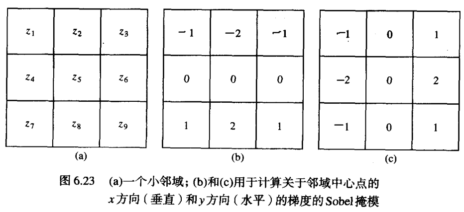
    最大梯度角度$\alpha(x,y)=arctan(\frac{G_y}{G_x})$
    - 彩色空间计算梯度      
    将这三个通道的信息看作是一个矢量，而矢量是不存在梯度的概念的，我们无法直接将上诉方法或算子直接用于RGB 图像，而且RGB图像单个通道的梯度信息又无法反映整体的梯度信息。
        - 彩色空间梯度推导      
        在多通道图像中，假设梯度方向为$\theta$
        $$\nabla f = ||f(x+\varepsilon cos\theta, y+\varepsilon sin\theta)||$$
        为了便于计算，将计算绝对值换为计算平方，令
        $$\nabla f^2 = ||f(x+\varepsilon cos\theta, y+\varepsilon sin\theta)||^2$$
        对$f(x+\varepsilon cos\theta, y+\varepsilon sin\theta)$进行二次泰勒展开：
        $$f(x+\varepsilon cos\theta, y+\varepsilon sin\theta)=f(x,y)+\sum_{i=1}^m (\varepsilon cos\theta \cdot \frac{\partial f_i(x,y)}{\partial x}+\varepsilon sin\theta \cdot \frac{\partial f_i(x,y)}{\partial y})+o^n$$
        $$\approx f(x,y)+\sum_{i=1}^m (\varepsilon cos\theta \cdot \frac{\partial f_i(x,y)}{\partial x}+\varepsilon sin\theta \cdot \frac{\partial f_i(x,y)}{\partial y})$$
        其中$m$表示图像通道数，为方便表述，用$\frac{\partial f_i}{\partial x}$代替$\frac{\partial f_i(x,y)}{\partial x}$,则有：
        $$\nabla f^2 = \sum_{i=1}^m (\varepsilon cos\theta \cdot \frac{\partial f_i}{\partial x}+\varepsilon sin\theta \cdot \frac{\partial f_i}{\partial y})^2$$
        重新定义函数$G(\theta)$,令
        $$G(\theta)= \sum_{i=1}^m (\varepsilon cos\theta \cdot \frac{\partial f_i}{\partial x}+\varepsilon sin\theta \cdot \frac{\partial f_i}{\partial y})^2$$
        $$=\varepsilon^2 (cos\theta^2 \cdot \sum_{i=1}^m||\frac{\partial f_i}{\partial x}||^2+sin\theta^2 \cdot \sum_{i=1}^m||\frac{\partial f_i}{\partial y}||^2+2sin\theta cos\theta \sum_{i=1}^m \frac{\partial f_i}{\partial x} \frac{\partial f_i}{\partial y})$$
        因为要求$G(\theta)$最大值，$\varepsilon$无用，舍去
        $$G(\theta)=cos\theta^2 \cdot \sum_{i=1}^m||\frac{\partial f_i}{\partial x}|^2|+sin\theta^2 \cdot \sum_{i=1}^m||\frac{\partial f_i}{\partial y}||^2+2sin\theta cos\theta \sum_{i=1}^m \frac{\partial f_i}{\partial x} \frac{\partial f_i}{\partial y}$$
        为了进一步方便表述；令 
        $$E=\sum_{i=1}^m||\frac{\partial f_i}{\partial x}||^2; F=\sum_{i=1}^m||\frac{\partial f_i}{\partial y}||^2; H=\sum_{i=1}^m \frac{\partial f_i}{\partial x} \frac{\partial f_i}{\partial y}$$      
        $$G(\theta)=cos\theta^2 E + sin\theta^2 F + 2sin\theta cos\theta H$$
        边缘的方向是图像像素梯度最大的方向。也就是说梯度的方向\theta_max会使G(\theta)取最大值，则；
        $$\theta_max=\mathop{G(\theta)}\limits_{argmax}$$
        对$G(\theta)$进行求导
        $$G(\theta)'=-Ecos(2\theta)+2Fcos(2\theta)+Hsin(2\theta)$$
        令$G(\theta)'=0$，可得：
        $$tan(2\theta_max)=\frac{2F}{E-H}$$
        $$\theta_max=\frac{1}{2}arctan(\frac{2F}{E-H}+k\pi)$$
        很明显$G(\theta )$是一个以\pi为周期的周期函数，如果只考虑区间$\left [ 0 ,\pi\right )[0,π)$，且$\theta_{max}$落到该区间内，则会有另一个让$G(\theta )$取极值的解也落在该区域内，
        这个值是$\theta_{max}+ \frac{\pi}{2}$或者$\theta_{max}-\frac{\pi}{2}$。但是不论如何这两个解有一个让$G(\theta )$取极大值，另一个让其取极小值，两个角度相差 90°。
        - 应用计算     
        设$\vec r,\vec g, \vec b$分别是RGB彩色空间定义向量，并定义向量
        $$\vec u = \frac{\partial R}{\partial x} \vec r + \frac{\partial G}{\partial x} \vec g + \frac{\partial B}{\partial x} \vec b$$
        $$\vec v = \frac{\partial R}{\partial y} \vec r + \frac{\partial G}{\partial y} \vec g + \frac{\partial B}{\partial y} \vec b$$
        $g_xx,g_yy,g_xy$是这些向量的点积：
        $$g_xx= \vec u \cdot \vec u =\vec u^T \vec u =|\frac{\partial R}{\partial x}|^2+|\frac{\partial G}{\partial x}|^2 +|\frac{\partial B}{\partial x}|^2$$
        $$g_xx= \vec v \cdot \vec v =\vec v^T \vec v =|\frac{\partial R}{\partial y}|^2+|\frac{\partial G}{\partial y}|^2 +|\frac{\partial B}{\partial y}|^2$$
        $$g_xx= \vec u \cdot \vec v =\vec u^T \vec v =\frac{\partial R}{\partial x}\frac{\partial R}{\partial y}+\frac{\partial G}{\partial x}\frac{\partial G}{\partial y} +\frac{\partial B}{\partial x}\frac{\partial B}{\partial y}$$
        梯度方向角：
        $$\theta(x,y)=\frac{1}{2}arctan[\frac{2g_xy}{g_xx-g_yy}]$$
        梯度值：
        $$F_\theta(x,y)=\{ \frac{1}{2}[(g_xx+g_yy)+(g_xx-g_yy)cos2\theta+2g_xy sin2\theta\}]^{1/2}$$
        - MATLAB
        
        ``` 
        [VG, A, PPG]= colorgrad(f,T)
        ```
        其中，f是RGB图像，T是[0,1]范围内的阈值选项(默认为0)；
        VG是RGB向量梯度$F_\theta(x, y)$；A是以弧度计的角度$\theta(x, y)$，并且PPG是由单独彩色平面的2D梯度之和形成的梯度图像。
        计算上述方程时，要求全部微分都可用函数clorgrad中的Sobel算子来实现。输出VG和PPG通过clorgrad被归一化到[0, 1]范围内，并且把它们作为阈值进行处理。所以，它们的值小于或等于T，VG(x,y)=0；对于其他的情况，$VG(x,y) = VG(x,y)$。
        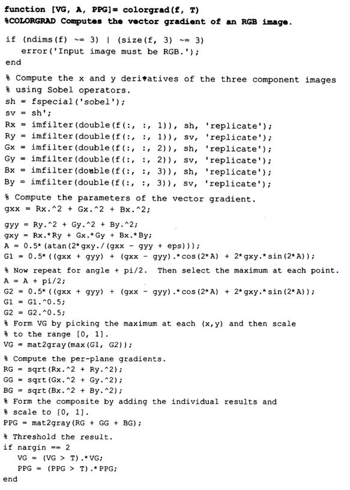
        - python     
        Q:!!!没有彩色图像梯度？都是sobel与laplacian
* RGB向量空间中的图像分割
    - 距离度量(计算相似度)
        - 欧几里得距离
        $$D(\vec z,\vec m)=||\vec z - \vec m||=[(\vec z - \vec m)^T(\vec z - \vec m)]^{1/2}$$
        - 马氏距离（mahalanobis）
        $$D(\vec z,\vec m)=[(\vec z - \vec m)^T C^{-1}(\vec z - \vec m)]^{1/2}$$
        C是要分割的彩色样值表示的协方差矩阵。马氏距离一个三维椭圆体，重要属性是主轴取在最大数据扩展方向上。
        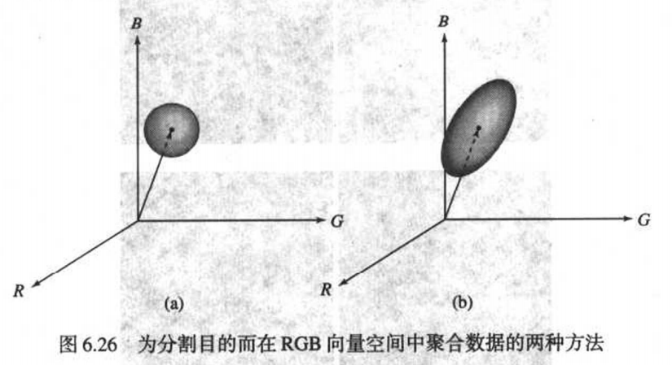
        **马氏距离与尺度无关**    
        如果是单纯使每个变量先标准化，然后再计算距离，可能会出现某种错误，原因是可能在有些多维空间中，某个两个维之间可能是线性相关的。
        通过对线性无关的分量进行标准化后，再求得距离是合理的。    
        mahalanobis距离是基于样本分布的一种距离。物理意义就是在规范化的主成分空间中的欧氏距离。    
        它的缺点是夸大了变化微小的变量的作用。    
    - 马氏距离推导
        - 基本思想      
        如下图的过程（以两个维度作为例子），此例的数据重心为原点，P1,P2到原点的欧氏距离相同，但点P2在y轴上相对原点有较大的变异，而点P1在x轴上相对原点有较小的变异。所以P1点距原点的直观距离是比P2点的小的。
        
        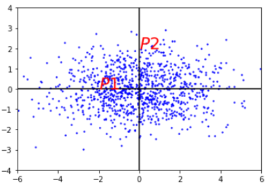     
        马氏距离就是解决这个问题，它将直观距离和欧式距离统一。为了做到这一点， 它先将数据不同维度上的方差统一（即各维度上的方差相同），此时的欧式距离就是直观距离。
        如下图：统一方差后的图，P1^到原点的距离小于P2^。P1到原点的欧式距离和P2的相同。以上所说的直观距离就是马氏距离。
        
        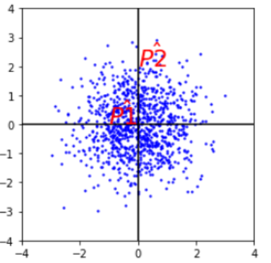     
        但是，如果不同维度之间具有相关性，则压缩的效果就不好了。如下图只在横向和纵向上压缩，则达不到上图的压缩效果。所以在F1方向和F2方向上压缩数据才能达到较好的效果。所以需要将原始数据在XY坐标系中的坐标 表示在F坐标系中。然后再分别沿着坐标轴压缩数据。
        
        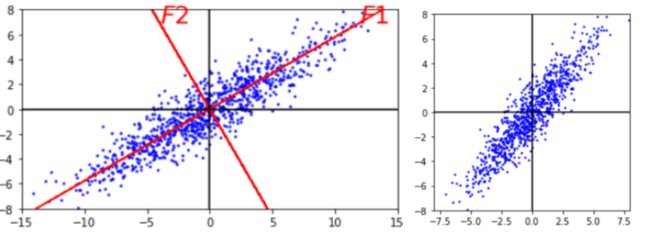     
        所以，计算样本数据的马氏距离分为两个步骤：1、坐标旋转；2、数据压缩     
        **坐标旋转的目标**：使旋转后的各个维度之间线性无关，所以该旋转过程就是主成分分析的过程。    
        **数据压缩的目标**：所以将不同的维度上的数据压缩成为方差都是1的的数据集。     
        - 理论推导      
        有一个原始的多维样本数据$X_{n*m}$(m列，n行):
        $$
        \begin{matrix}
        x_{11} & x_{12} & \cdots & x_{1m}\\
        x_{21} & x_{22} & \cdots & x_{2m}\\
        \vdots & \vdots & \ddots & \vdots \\
        x_{n1} & x_{n2} & \cdots & x_{nm}
        \end{matrix} 
        $$
        其中每一行表示一个测试样本（共n个）；$X_i$表示样本的第i个维度（共m个）。$X_i=(x_{1i},x_{2i},…,x_{ni})^T$ ，以上多维样本数据记为$X=(X_1,X_2⋯X_m)$。样本的总体均值为$\mu_X=(\mu_{X1},\mu_{X2}⋯\mu_{Xm})$。其协方差为：
        $$\sum X=E{(X−\mu_X)^T(X−\mu_X)}=\frac{1}{n}(X−\mu_X)^T(X−\mu_X)$$
        协方差矩阵表示样本数据各维度之间的关系的。其中n是样本的数量。         
        将原始数据集X通过坐标旋转矩阵U旋转到新的坐标系统中得到一个各变量线性无关的新的数据集F。
        $$F^T = (F_1,F_2 \cdot F_m)^T = UX^T \tag{(1)}$$
        新数据集F的均值记为$\mu_F=(\mu_{F_1},\mu_{F_2}⋯\mu_{F_m}), \mu_F=U\mu_X \tag{(2)}$    
        由公式$(1)(2)$可知：$(F−\mu_F)=(X−\mu_X)U^T \tag{(3)}$     
        由于F的各维度之间是不相关的，所以新数据集F的协方差矩阵\sum_F应该为对角阵，由公式$(3)$可得：   
        $${\sum}_F = E{(F−\mu_F)^T (F−\mu_F)}= \frac{1}{n}(F−\mu_F)^T (F−\mu_F)$$
        $$=\frac{1}{n} U(X−\mu_X)^T(X−\mu_X)U^T =U {\sum}_X U^T=
        \left[
        \begin{matrix}
        \lambda_1 & & & \\
         & \lambda_2 & & \\
         &  & \ddots &  \\
         &  & & \lambda_m 
        \end{matrix}
        \right]
        $$
        可以看出，其中$X$数据的协方差的根号特征值 $\sqrt{\lambda_i}$ 就是$F$数据中第i个维度的方差。U为$\sum_X$的特征向量构成的正交矩阵 $U^T=U^{−1}$。     
        将不同的维度上的数据压缩成为方差都是1，以下推导马氏距离公式：    
        $$d^2(f,\mu_F)= (\frac{F_1-\mu_{F_1}}{\sqrt{\lambda_1}})^2+(\frac{F_2-\mu_{F_2}}{\sqrt{\lambda_2}})^2+ \cdot +(\frac{F_m-\mu_{F_m}}{\sqrt{\lambda_m}})^2$$
        $$=(F_1−\mu_{F_1},F_2−\mu_{F_2}⋯ F_m−\mu_{F_m})
        \left[\begin{matrix}
        \frac{1}{\lambda_1} &            &       &             \\
                   & \frac{1}{\lambda_2} &       &             \\
                   &            & \ddots &             \\
                   &           &       & \frac{1}{\lambda_m }
        \end{matrix}\right] 
        (F_1−\mu_{F_1},F_2−\mu_{F_2}⋯ F_m−\mu_{F_m})^T   $$
        $$=(F−\mu_F)(U {\sum}_X U^T)^{−1}(F−\mu_F)^T=(X−\mu_X)U^T(U{\sum}_X U^T)^{−1} U(X−\mu_X)^T = (X−\mu_X) {\sum}_X^{−1} (X−\mu_X)^T$$       
        
    - MATLAB      
        - 函数
        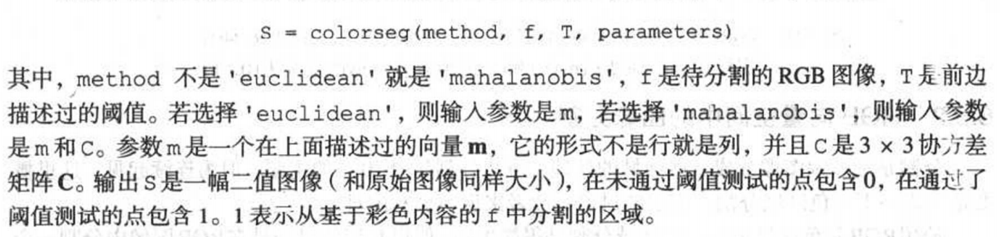
        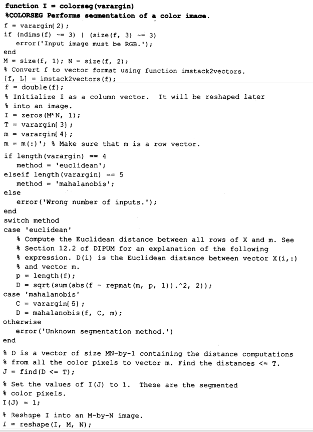
        - 案例     
        
        ```
        mask= roipoly(f); %交互式确定感兴趣区域
        red= immuliply(mask, f(:,:,1));
        green= immuliply(mask, f(:,:,2));
        blue= immuliply(mask, f(:,:,3));
        g = cat(3, red, green, blue);
        %计算均值向量与协方差矩阵
        [M N K] = size(g)
        I = reshape(g, M*N, 3)
        idx = find(mask)
        I = double(I(idx, 1:3))
        [C, m] = covmatrix(I) %求协方差矩阵与均值向量
        %d = diag(C)
        %sd = sqrt(d)
        E25 = colorseg('mahalanobis',f,25,m)
        ```
        
        
