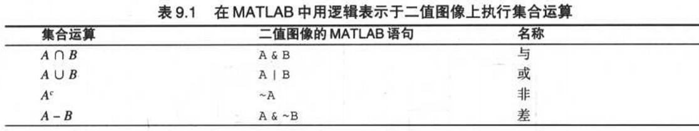
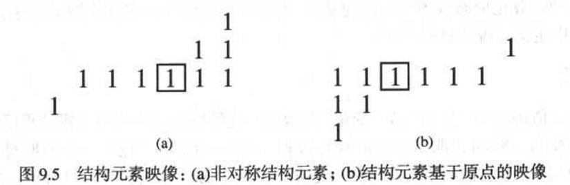
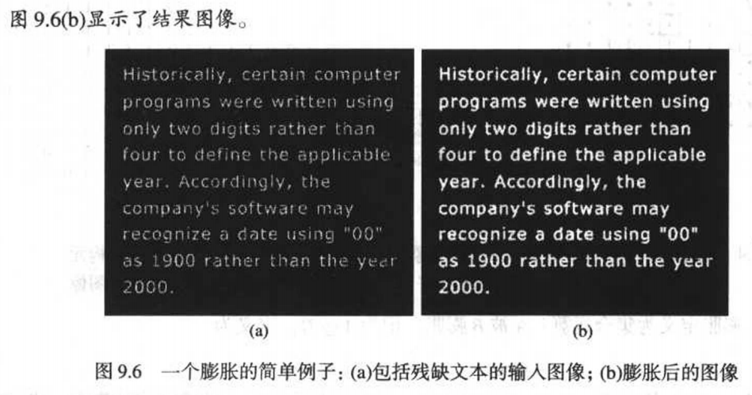
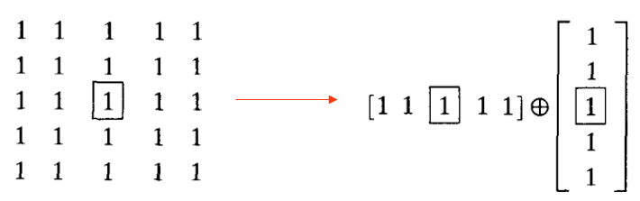
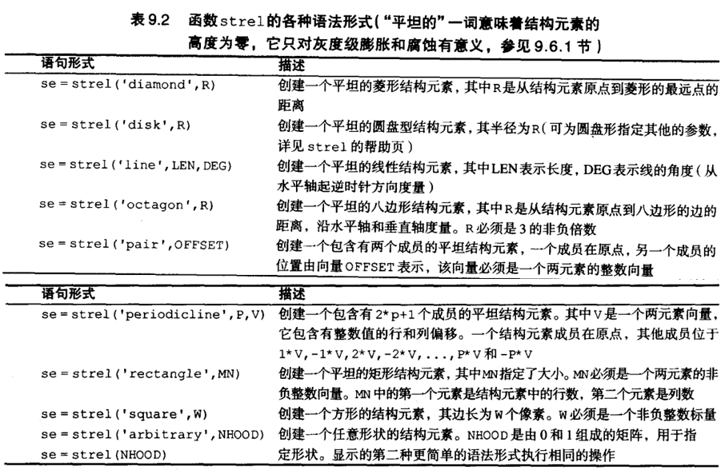
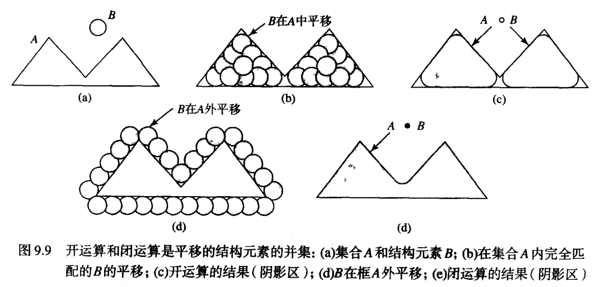
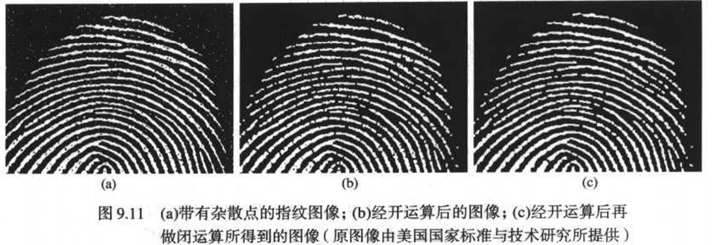
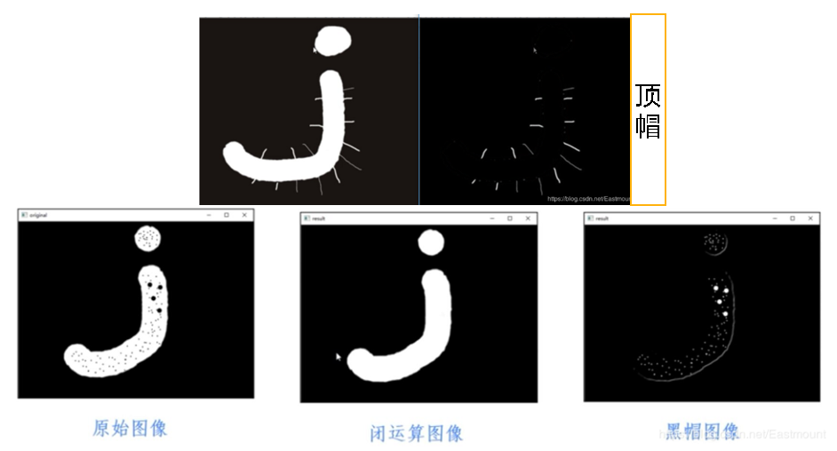
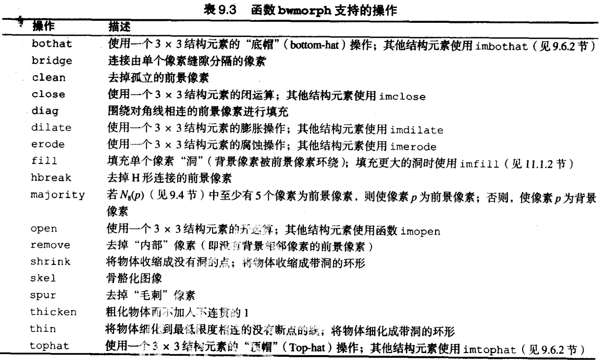

# 形态学图像处理
## 二值图像集合运算

## 膨胀和腐蚀
### 膨胀
* 原理    
数学上，膨胀定义为集合运算。A被B膨胀，记为     
$$ A\oplus B=\{z|(\hat{B})_z \cap A \neq \emptyset\} $$
其中，B为结构元素，$\hat{B}$为B的映像，定义为$\hat{B}=\lbrace \omega|\omega=-b,b\epsilon B \rbrace$。    
$(B)_z$为点$z=(z_1,z_2)$对集合B的平移运算，定义为$(B)_z=\lbrace c|c=b+z,b\epsilon B \rbrace$     
总之，$A \oplus B$是所有结构元素原点位置组成的集合，其中映射并平移后的B至少与A的某些部分重叠。

* MATLAB      

``` 
A = imread('broken_text.tif')
B = [ 0 1 0;1 1 1;0 1 0 ]
A2=imdilate(A,B)
```
     
* 结构元素的分解     
膨胀满足结合律，即：$A\oplus(B \oplus C)=(A \oplus B)\oplus C$     
假设构造元素B可以表示为两个构造元素$B_1$和$B_2$的膨胀，即：$B=B_1\oplus B_2$，则$A\oplus B=(A\oplus B_1)\oplus B_2$
   
原始构造元素中的元素为25，分解后只有10个，运算速度快2.5倍。？？不对吧，分解后的第二次膨胀不是5x5？？
* 函数strel构造结构元素      

除了可以生成结构元素，strel还可以以分解形式产生结构元素。imdilate将自动使用分解信息加快膨胀处理。
函数`decomp=getsequence(se);decomp(1)`可用于提取并检查分解中的单个结构元素
### 腐蚀
* 原理     
腐蚀的数学定义与膨胀相似，A被B腐蚀即为$A\ominus B$，定义为
$$ A \ominus B=\lbrace z|(\hat{B})_z \cap A^c \neq \emptyset \rbrace $$
* MATLAB    
``` 
A=imrode(A, se)
```
* python     
```python
#设置卷积核5*5
kernel = np.ones((5,5),np.uint8)
#图像的腐蚀，默认迭代次数
erosion = cv2.erode(src,kernel)
#图像的膨胀
dst = cv2.dilate(erosion,kernel)
```
## 腐蚀和膨胀的组合
### 开运算和闭运算
开运算使二值图中细小连接部分断开(去除杂点)，闭运算使二值图中缺口被填补。     
    
可对图像先开运算，去除杂点；再闭运算，填补缺口，增强连接。

* 开运算    
A被B的形态学开运算可以记做$A\circ B$,是A被B腐蚀再用B来膨胀的结果：
$$A\circ B=(A\ominus B)\oplus B=\cup{(B)_z|(B)_z\subseteq A}$$
$A\circ B$可理解为，B在A内完全匹配的平移的并集。
* 闭运算  
$$ A\bullet B=(A\oplus B)\ominus B $$
* MATLAB    
``` 
C=imopen(A,B)
C=imclose(A,B)
```
* python
```python
kernel = np.ones((5,5),np.uint8)
closing = cv2.morphologyEx(img, cv2.MORPH_CLOSE, kernel)
opening = cv2.morphologyEx(img, cv2.MORPH_OPEN, kernel)
#图像的膨胀和腐蚀之间的差异，结果看起来像目标的轮廓
gradient = cv2.morphologyEx(img, cv2.MORPH_GRADIENT, kernel)
```
### 击中或击不中变换
用于识别特定形状（线段端点、），B为结构元素$B=(B_1, B_2)$
$$A\otimes B = (A\ominus B_1)\cap(A^c\ominus B_2)$$
可理解为，输出图像由$B_1$中匹配的像素（被击中）和同时未被$B_2$匹配的像素组成
```
%MATLAB
B1=strel([0 0 0;0 1 1;0 1 0])%定位东、南邻域的像素
B2=strel([1 1 1;1 0 0;1 0 0])
g=bwhitmiss(f, B1, B2)
```
### 使用查找表
选用击中或击不中变换的较快方法是使用查找表（LUT），将所有结构元素（$2^9=512$个$3*3$的patch）储存在表中，
索引为patch与下面矩阵的点乘，然后把所有加起来。该过程得到的索引为在范围[0,511]中的唯一一个值。
$$
\begin{matrix}
1 & 8  & 64\\
2 & 16 & 128 \\
4 & 32 & 256
\end{matrix}
$$
### 顶帽与黑帽
* 图像顶帽（或图像礼帽）运算是原始图像减去图像开运算的结果，得到图像的噪声。如下图所示：    
顶帽运算(img) = 原始图像(img) - 开运算(img)       
可以看到外部噪声被提取出来
* 图像黑帽运算是图像闭运算操作减去原始图像的结果，得到图像内部的小孔，或者前景色中的小黑点。如下图所示：      
黑帽运算(img) = 闭运算图像(img) - 原始图像(img)      
可以看到图像内部黑点被提取出来

* python
```python
#创建特殊构造元素，MORPH_RECT矩形，MORPH_ELLIPSE椭圆，MORPH_CROSS十字
kernel=cv2.getStructuringElement(cv2.MORPH_RECT,(5,5))
#顶帽
kernel = np.ones((5,5),np.uint8)
tophat = cv2.morphologyEx(img, cv2.MORPH_TOPHAT, kernel)
#黑帽
blackhat = cv2.morphologyEx(img, cv2.MORPH_BLACKHAT, kernel)
```
### MATLAB IPT函数bwmorph
可用于膨胀、腐蚀、查找表操作的组合，实现许多有用的操作



