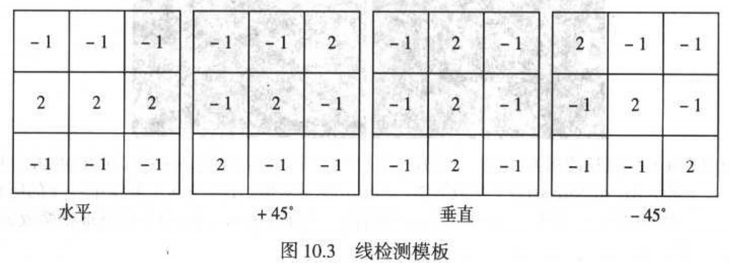
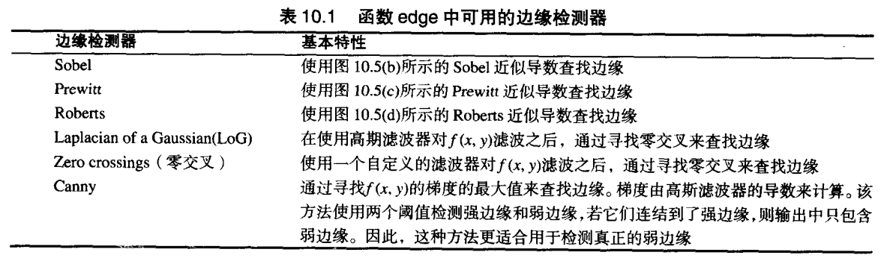
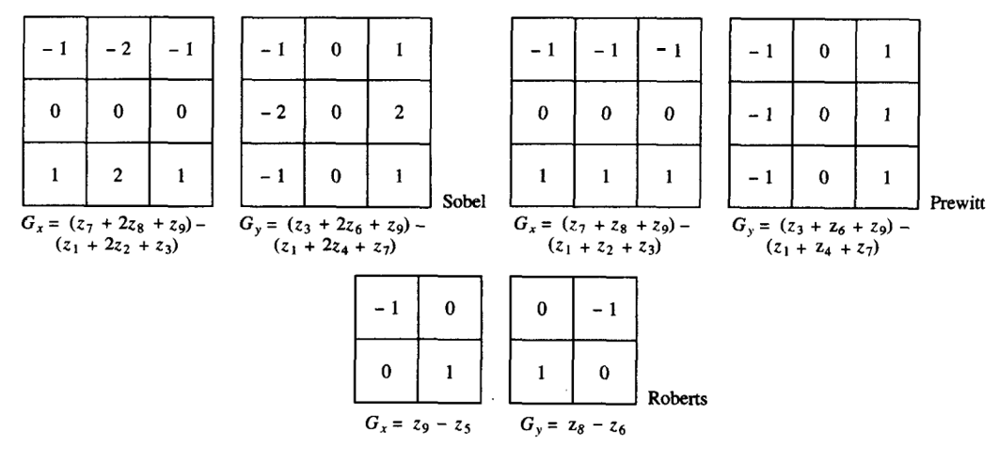
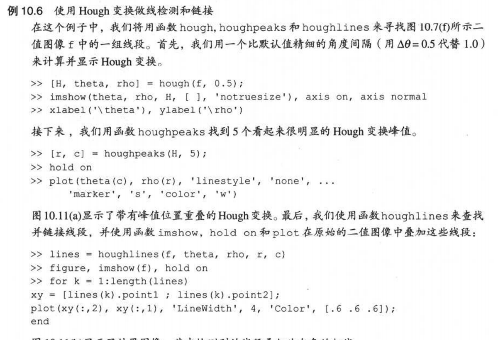

# 图像分割
##  点、线和边缘检测
点、线和边缘是亮度不连续的三种基本类型。**用于查找不连续的最常用方法**是空间滤波。掩膜在一点处的响应为：    
$$R= \omega_1 z_1 + \omega_2 z_2 + \cdots + \omega_9 z_9 = \sum_{i=1}^9 \omega_i z_i$$
### 点检测     
* 空间滤波检测       
点检测模板为：$[-1,-1,-1;-1,8,-1;-1,-1,-1]$   
  
    - MATLAB      
    
    ```   
    w = [-1,-1,-1;-1,8,-1;-1,-1,-1]     
    g = abs(imfilter(double(f),w))    
    T = max(g(:))    %阈值设为最大值，只提取最大响应点    
    g = g>=T    
    ```   
    
* 领域排序检测   
将$m*n$的邻域中左右像素值进行排序，如果这些点最大值与最小值之差超过了T，则判断为有点区域，可把最大值作为点。
    - MATLAB     
    
    ``` 
    %函数ordfilt2为分线性滤波函数，可用于排序
    g= imsubtract(ordfilt2(f, m*n, ones(m,n)),... ordfilt2(f, 1, ones(m,n)))
    g= g>=T
    %可用m*n-1替代最右端的1，从而得到最高像素值和第二高像素值的差值。
    ```

### 线检测
* 空间滤波检测
    以下滤波核分别在水平线、+45°线、垂直线、-45°线响应最大。每个掩膜系数之和为0，表明亮度不变区域响应为0。    
         
    提取的边缘只有单个像素宽度，应同时使用点检测模板，删除孤立点。    
* 一阶/二阶导数检测    
基本原则：1、找到亮度的一阶导数在幅度上比指定的阈值大的地方；2、找到亮度的二阶导数（拉普拉斯算子）有零交叉的地方。
    - MATLAB—edge函数进行边缘检测           
    梯度$g=({G_x}^2+{G_y}^2)^2$        
          
    ```     
    [g,t]= edge(f, 'method'. parameters) %基本语法   
    %g为0,1逻辑数组，t为edge函数使用的阈值，‘method’为表10.1中的方法，parameters根据method不同而变化   
    [g,t]= edge(f, 'sobel'. T, dir)  %sobel。dir为指定检测首选方向：'horizontal','vertical','both'   
    [g,t]= edge(f, 'prewitt'. T, dir) %prewitt   
    [g,t]= edge(f, 'roberts'. T, dir) %roberts   
    [g,t]= edge(f, 'log'. T, sigma) %LoG   
    [g,t]= edge(f, 'zerocross'. T, H) %零交叉。H为指定的滤波函数   
    [g,t]= edge(f, 'canny'. T, sigma) %canny。T=[T1, T2]   
    ```      
    
       
    
    - LoG（高斯拉普拉斯）检测器    
    高斯函数$h(r)=-e^{-\frac{r^2}{2\sigma^2}}$，其中$r^2=x^2 +y^2$。与图像卷积将会变模糊。   
    该函数的拉普拉斯算子为$\nabla h(r)= -(\frac{r^2-\sigma^2}{\sigma^4}) e^{-\frac{r^2}{2\sigma^2}}$      
    使用LoG将产生两个效果：1、使图像平滑。2、计算拉普拉斯算子，以产生双边缘图像。        
    
    ```python
    import cv2
    #只有laplacian     
    img = cv2.imread('test.jpg') 
    #对彩色图
    gray_lap = cv2.Laplacian(img,cv2.CV_16S,ksize = 3)  
    dst = cv2.convertScaleAbs(gray_lap)   
    #对灰度图
    kernel_size = 3; scale = 1;delta = 0;ddepth = cv2.CV_16S
    img = cv2.GaussianBlur(img,(3,3),0)    
    gray = cv2.cvtColor(img,cv2.COLOR_BGR2GRAY)    
    gray_lap = cv2.Laplacian(gray,ddepth, ksize = kernel_size,scale = scale,delta = delta)    
    dst = cv2.convertScaleAbs(gray_lap)   
    ```     
    - canny边缘检测    
    算法流程：   
    1、高斯滤波平滑。2、计算梯度（sobel,prewitt,roberts都可以）。       
    3、非极大值抑制，只保留最大脊线。         
    4、8邻域，弱边缘集成到强边缘。（大于T2为强边缘，T1与T2之间为弱边缘）      
    
    ```python
    #使用Canny算子进行边缘检测
    edge_output = cv2.Canny(out_img_GRAY, 10, 300)
    #用sobel算子进行边缘检测
    sobel = cv2.Sobel(out_img_GRAY,-1,1,0,ksize=3)
    ```  
    
## Hough变换的线检测
参数空间变换，将$xy$坐标系变为$ab$坐标系$y=ax+b$，或$\theta \rho$坐标系$(xcos\theta +ysin\theta =\rho)$。    
``` 
>>A=[0 0 0 5;0 2 0 0;0 0 0 0;0 0 0 0]
>>S=sparse(A)
  S=(2,2)  2
    (1,4)  5   
>>A=full(S)
```

* MATLAB   
       
``` 
%绘制Hough变换后空间的曲线  
function [h, theta, rho]= hough(f, dtheta, drho)
if nargin<3
    drho = 1;
end
if nargin<2
    stheta = 1;
end
f = double(f)
[M N] = size(f)
ntheta = ceil(180/dtheta)+1
theta = linspace(-90. 90, ntheta);
D = sqrt((M-1)^2+(N-1)^2)
q = ceil(D/drho)
nrho = 2*q -1
rho = linspace(-q*drho, q*drho, nrho)

[x, y, val] = find(f) %寻找不为0的索引
x=x-1;y=y-1;
h= zeros(nrho, ntheta) 
%可取之处，1000个数一循环，全是向量化。栅格内投票时，直接用sparse
for k = 1:ceil(length(val)/1000)
    first = (k-1)*1000+1;
    last = min(first+999,length(x))
    x_matrix = repmat(x(first:last), 1, ntheta)  %B = repmat(A,m,n);把 A 作为 B 的元素，B 由 m×n 个 A 平铺而成
    y_matrix = repmat(y(first:last), 1, ntheta)
    val_matrix = repmat(val(first:last), 1, ntheta)
    theta_matrix = repmat(theta, size(x_matrix, 1), ntheta)*pi/180
    rho_matrix = x_matrix.*cos(theta_matrix)+ y_matrix.*sin(theta_matrix)
    slope = (nrho -1)/(rho(end)-rho(1));
    rho_bin_index = round(slope*(rho_matrix - rho(1))+ 1)
    theta_bin_index = repmat(1:ntheta, size(x_matrix,1), 1)
    %使用sparse把对应元素存入
    h=h+ full(sparse(rho_bin_index(:), theta_bin_index(:), val_matrix(:), nrho, ntheta))
end
```

### Hough变换做峰值检测
1、找到包含最大值的Hough变换单元，并记下位置     
2、把第一步找到的最大值点的邻域清零    
3、重复该步骤，一直找到需要的峰值数，或者达到一个指定阈值     

```
function[r,c,hnew] = houghpeaks(h, numpeaks, threshhold, nhood)
if nargin <4
    nhood = size(h)/50
    nhood = max(2*ceil(nhood/2)+1, 1) %保证是奇数
end
if nargin <3
    threshold = 0.5* max(h(:))
end
if nargin<2
    numpeaks = 1;
end
done = False
hnew = h; r=[];c=[];
while ~done
    [p,q]= find(hnew == max(hnew(:)))
    p=p(1);q=q(1)
    if hnew(p, q) >= threshold
        r(end +1) = p; c(end +1) = q;
        p1=p-(nhood(1)-1)/2;p2=p+(nhood(1)-1)/2;
        q1=q-(nhood(2)-1)/2;q2=q+(nhood(2)-1)/2;
        [pp, qq]=ndgrid[p1:p2, q1:q2] %ndgrid生成网格
        %对于rho方向，超界直接删除
        pp=pp(:);qq=qq(:);
        badrho = find((pp<1)|(pp>size(h, 1)));%找到在范围内的
        pp(badrho) = []; qq(badrho) = [];
        %对于theta，[-90,90]形成闭环，即-91°应为89°
        theta_too_slow = find(qq<1);
        qq(theta_too_slow)=size(h,2)+qq(theta_too_slow)
        pp(theta_too_slow)=size(h,1)-pp(theta_too_slow)+1
        theta_too_high=find(qq>size(h, 2))
        qq(theta_too_high)=qq(theta_too_high)-size(h,2)
        pp(theta_too_high)= size(h,1) -pp(theta_too_high)+1
        %
        hnew(sub2ind(size(hnew),pp,qq)) =0;
        done = length(r) == numpeaks
    else  
        done =true
    end
end
```

### Hough变换做线检测和链接
确定Hough峰值后，需要确定与这些峰值相关的线段及起始位置。     
* 第一步，找到影响峰值的每一个非零值点的位置    
    
``` 
function[r, c]=houghpixels(f, theta, rho, rbin, cbin)
[x,y,val]=find(f)
x=x-1;y=y-1
theta_c = theta(cbin) *pi/180;
rho_xy = x*cos(theta_c)+ y*sin(theta_c)
nrho = length(rho)
slope = (nrho-1)/(rho(end)-rho(1))
rho_bin_index = round(slope*(rho_xy -rho(1))+1)
idx = find(rho_bin_index == rbin)
r = x(idx) +1;c=y(idx)+1;
```      

* 第二步，将houghpixels找到的位置相关像素组合成线段。步骤如下：        
1、将像素旋转$90°-\theta$，以便他们大概位于同一直线
2、按旋转的x对像素位置分排序    
3、使用diff函数找到裂口，合并被小空白分离的线段。   
4、返回比最小阈值长的线段       

``` 
function lines = houghlines(f, theta, rho, rr, cc, filllap, minlength)
%theta,rho为HOUGH函数的输出；rr,cc为houghpeaks输出；filllap和minlength为裂口和线段长度阈值
if nargin < 6
    fillgap = 20
end
if nargin <7
    minlength = 40
end
numlines = 0;lines = struct;
for k = 1: length(rr)
    rbin = rr(k); cbin = cc(k);
    [r, c] = houghpixels(f, theta, rho, rbin, cbin)
    if isempty(r)
        continue
    end
    %坐标旋转矩阵
    omega = (90 - theta(cbin)) * pi / 180
    T = [cos(omega) sin(omega); -sin(omega) cos(omega)]
    xy = [r-1, c-1] * T
    x = sort(xy(:, 1))
    %找到比阈值大的间断
    diff_x = [diff(x); Inf]
    for p = 1: length(idx) - 1
        x1= x(idx(p)+1); x2 = x(idx(p + 1))
        linelength = x2 - x1
        if linelength > minlength
            point1 = [x1, rho(rbin)]; point2 = [x2, rho(rbin)]
            Tinv = inv(T)
            point1 = point1 * Tinv; point2 = point2 * Tinv;
            numlines = numlines + 1
            lines(numlines).point1 = point1 +1
            lines(numlines).point2 = point2 +1
            lines(numlines).length = linelength
            lines(numlines).theta = theta(cbin)
            lines(numlines).rho = rho(cbin)
        end
    end
end         
```
* 使用

## 阈值处理
### 全局阈值
**最大类间方差（Otsu）** 
* 类间方差         
$${\sigma_B}^2 = \omega_0(\mu_0 - \mu_T)^2 + \omega_1(\mu_1 - \mu_T)^2$$
其中，离散概率密度归一函数$p_r(r_q) = \frac{n_q}{n},  q = 0,1,2,\cdot,L-1$       

      每一类出现的概率$\omega_0 = \sum_{q=0}^{k-1} p_q(r_q)$，$\omega_1 = \sum_{q=k}^{L-1} p_q(r_q)$       
      
      平均灰度级$\mu_0 = \sum_{q=0}^{k-1} qp_q(r_q)/\omega_0$，$\mu_1 = \sum_{q=k}^{L-1} qp_q(r_q)/\omega_1$     
      
      灰度级从1到k的累积出现概率和平均灰度级（一阶累积矩）$\mu_T = \sum_{q=0}^{L} qp_q(r_q)$    
* 类内方差    
${\sigma_0}^2 = \sum_{q=0}^{k}p_q(r_q)(\mu_0 - \mu_0)^2 / \omega_0$，${\sigma_1}^2 = \sum_{q=k}^{L-1}p_q(r_q)(\mu_1 - \mu_1)^2 / \omega_1$     
### 局部阈值
先调整亮度分布再全局阈值，效果相同

        
    


