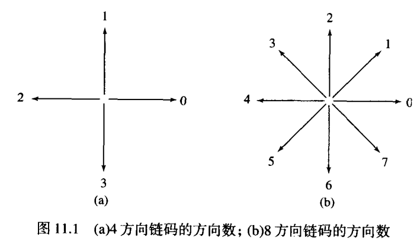
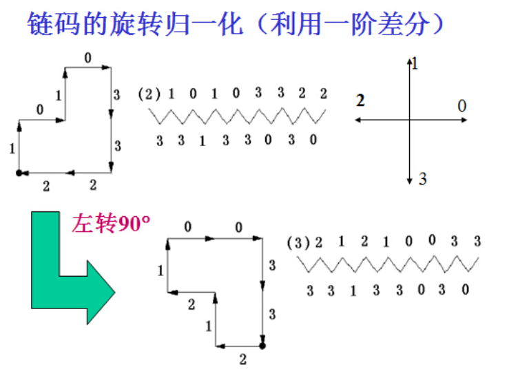
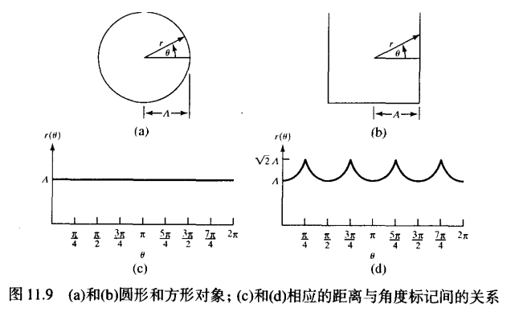
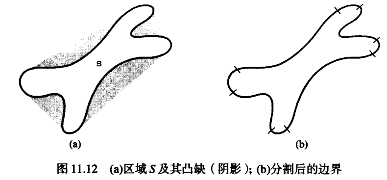

# 表示与描述 
对形状感兴趣时，可以选用外部表示（边界—长度、凹凸情况）；关注区域属性时，可选用内部表示（组成的像素—颜色、纹理）。     
描述子应尽可能对区域大小、平移与旋转的变换不敏感。
## 表示
### 链码
Freeman链码：

归一化差分链码具有唯一性、平移不变性、旋转不变性     

* MATLAB

``` 
b = boundaries(f, conn, dir) %产生边界，最后一个点与第一个点相同
%找到最长边界
d = cellfun('length', B)
[max_d, k]= max(d)
v= B{k(1)}
%可能序列很长，这时需要二次采样（网格分离）
[s su] = bsubsamp（b， 50）
%Freeman编码
c = fchcode(b, conn, dir) %conn = 4或8； dir= 'same'或'reverse'
%b为np*2个已排序边界点集
%输出c为一结构体
%%c.fcc = Freeman链码(1xnp)
%%c.diff = c.fcc的一阶差分
%%c.mm = 最小幅度的整数(1xnp) %归一化链码
%%c.diffmm = c.mm的一阶差分   %逆时针差分
%%c.x0y0 = 代码开始处坐标(1x2)
```
相关函数为：
``` 
function B = boundaries(BW, conn, dir)
%B是一个{P,1}的元胞数组，每个元胞数组为（Q,2）的矩阵；BW为二值图；conn为4或8；dir为'cw'或'ccw'
if nargin < 3
    dir = 'cw'
end
if nargin < 2
    conn = 8
end
L = bwlabel(BW, conn)  %返回相同大小矩阵的连通域标签
if numOb > 0
    B = {zeros(0,2)}
    B = repmat(B, numOb, 1)
else
    B = {}
end
Lp = padarray(L, [1, 1], 0, 'both') %图像边缘补0，防止越界
M = size(Lp, 1)
if conn == 8
    %顺序为N NE E SE S SW W NW
    offsets = [-1, M-1, M, M+1, 1, -M+1, -M, -M-1]
else
    %顺序为N E S W 
    offsets = [-1, M, 1, -M]
end
if conn == 8
    next_search_direction_lut = [8 8 2 2 4 4 6 6 ]
else
    next_search_direction_lut = [4 1 2 3]
end
if conn == 8
    next_direction_lut = [2 3 4 5 6 7 8 1]
else
    next_direction_lut = [2 3 4 1]
end
START = -1
BOUNDARY = -2
scratch = zeros(100,1)
%找到边界起始点
[rr cc] = find((Lp(2:end-1, :))&(Lp(1:end-2, :) == 0))
rr = rr+1

```

### 最小周长多边形的多边形近似（MPP）
* 步骤：    
1、获得细胞联合体    
2、获取细胞联合体内部区域     
3、以4连接顺时针左边序列的形式获得边界     
4、获得边界的Freeman链码     
5、从链码中获得凸顶点和凹顶点     
6、使用凸顶点构造初始多边形，并删除位于多边形之外的凹顶点（角度大于180°）    
7、用剩下的凸顶点重新构造多边形    
8、继续删除凹顶点    
9、重复7、8，直到没有凹顶点     

### 标记
中心至边界的延伸向量只能和边界相交一次，并产生一个角度不断增加的单值函数     

### 边界片段
任意几何S的凸壳H是包含S的最小凸集。集合的差H-S成为S的**凸缺D**。   
区域边界通过沿S轮廓线标记进入与离开凸缺的点。   
这种处理方法要先减少非重要凹面，进行图像平滑处理


### 骨骼（表示平面区域结构形状）
中间轴变换（MAT）：一个边框为b的区域R，对R中的每个点p，寻找b中的最近邻点。若p比这样的临近点大，则称p属于R的中间轴线。