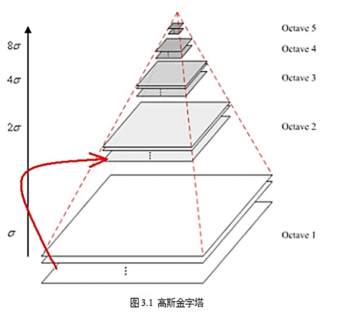
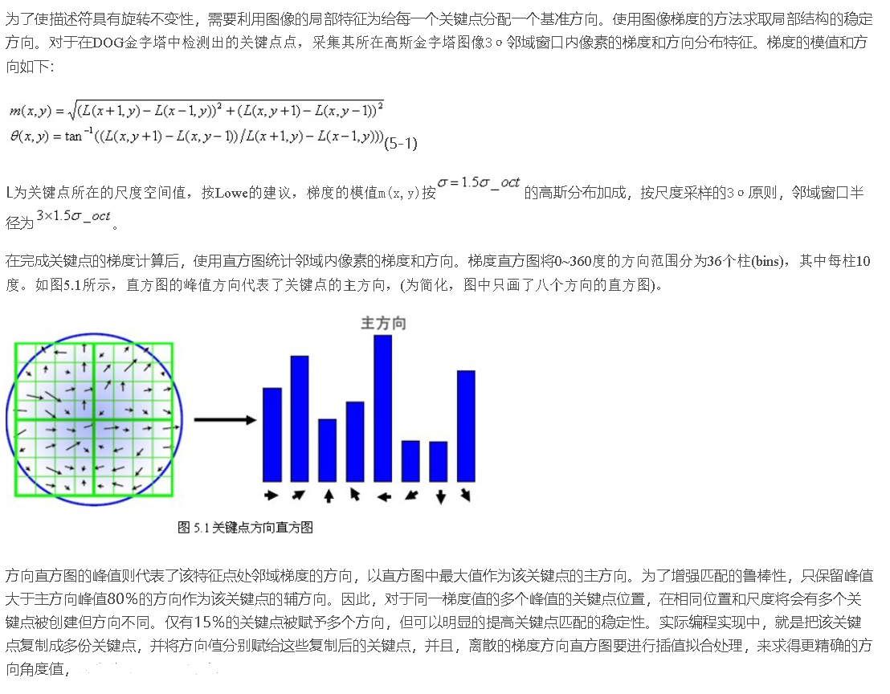
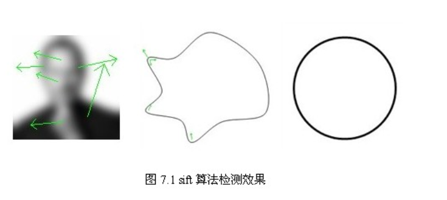

# SIFT原理(尺度不变特征变换匹配算法:Scale-invariant feature transform)
## SIFT算法分解为如下四步：
1. 尺度空间极值检测：搜索所有尺度上的图像位置。通过高斯微分函数来识别潜在的对于尺度和旋转不变的兴趣点。  
2. 关键点定位：在每个候选的位置上，通过一个拟合精细的模型来确定位置和尺度。关键点的选择依据于它们的稳定程度。  
3. 方向确定：基于图像局部的梯度方向，分配给每个关键点位置一个或多个方向。所有后面的对图像数据的操作都相对于关键点的方向、尺度和位置进行变换，从而提供对于这些变换的不变性。  
4. 关键点描述：在每个关键点周围的邻域内，在选定的尺度上测量图像局部的梯度。这些梯度被变换成一种表示，这种表示允许比较大的局部形状的变形和光照变化。  
## 高斯模糊
通常，图像处理程序只需要计算$(6\sigma + 1)*(6\sigma + 1)$的矩阵就可以保证相关像素影响。根据$\sigma$的值，计算出高斯模板矩阵的大小。同时，为了确保**模板矩阵中的元素在[0,1]之间**，需将模板矩阵归一化。
 $$G(x,y,\sigma) = \frac{1}{2\pi \sigma^2} e^{-\frac{(x-m/2)^2+(y-n/2)^2}{2\sigma^2}} $$
### 分离高斯模糊
造成边缘图像缺失,$\sigma$越大，图像边缘缺失像素越多。     
二维矩阵变换得到的效果也可以通过在水平方向进行一维高斯矩阵变换加上竖直方向的一维高斯矩阵变换得到。
** 优点 **      
* 加速计算。因为这样只需要$O(n*M*N)+O(m*M*N)$次计算，而二维不可分的矩阵则需要次计算O(m*n*M*N)，其中，m,n为高斯矩阵的维数，M,N为二维图像的维数。  
* 两次一维的高斯卷积将消除二维高斯矩阵所产生的边缘。(关于消除边缘的论述如下图2.4所示， 对用模板矩阵超出边界的部分——虚线框，将不做卷积计算。如图2.4中x方向的第一个模板1*5，将退化成1*3的模板，只在图像之内的部分做卷积。   

## 尺度空间极值检测
### 尺度空间理论的基本思想
在图像信息处理模型中引入一个被视为尺度的参数，通过连续变化尺度参数获得多尺度下的尺度空间表示序列，对这些序列进行尺度空间主轮廓的提取，并以该主轮廓作为一种特征向量，实现边缘、角点检测和不同分辨率上的特征提取等。

**尺度空间满足视觉不变性**   
* 当我们用眼睛观察物体时，一方面当物体所处背景的光照条件变化时，视网膜感知图像的亮度水平和对比度是不同的，因此要求尺度空间算子对图像的分析不受图像的灰度水平和对比度变化的影响，即满足**灰度不变性和对比度不变性**。      
* 另一方面，相对于某一固定坐标系，当观察者和物体之间的相对位置变化时，视网膜所感知的图像的位置、大小、角度和形状是不同的，因此要求尺度空间算子对图像的分析和图像的位置、大小、角度以及仿射变换无关，即满足**平移不变性、尺度不变性、欧几里德不变性以及仿射不变性**     
### 尺度空间的表示
一个图像的尺度空间，$L(x,y,\sigma)$定义为一个变化尺度的高斯函数$G(x,y,\sigma)$与原图像$I(x,y)$的卷积。
$$L(x,y,\sigma) = G(x,y,\sigma) \* I(x,y) $$  
$\sigma$是尺度空间因子，值越小表示图像被平滑的越少，相应的尺度也就越小。大尺度对应于图像的概貌特征，小尺度对应于图像的细节特征。
### 高斯金字塔的构建
尺度空间在实现时使用高斯金字塔表示，高斯金字塔的构建分为两部分：   
1. 对图像做不同尺度的高斯模糊；
2. 对图像做降采样(隔点采样,大小减为一半)。

* 金字塔层数
每个金字塔共n层。金字塔的层数根据图像的原始大小和塔顶图像的大小共同决定，其计算公式如下：
$$n = \log_2 {min(M,N)} - t   t\epsilon [0,\log_2 {min(M,N)})$$
其中M，N为原图像的大小,t为塔顶图像的最小维数的对数值。如，对于大小为512*512的图像，金字塔上各层图像的大小如表3.1所示，当塔顶图像为4*4时，n=7，当塔顶图像为2*2时，n=8。

* 金字塔每层的组(Octave)
图像金字塔每层的一张图像使用不同参数做高斯模糊，使得金字塔的每层含有多张高斯模糊图像，将金字塔每层多张图像合称为一组(Octave).   
另外，降采样时，高斯金字塔上一组图像的初始图像(底层图像)是由前一组图像的**倒数第三张图像**隔点采样得到的。  
```
第0组(即第-1组)：  0 1  2  3  4   5   
第1组：            6 7  8  9  10 11   
第2组：            ？   
则第2组第一张图片根据第一组中索引为9的图片降采样得到，其它类似
```
### 高斯差DOG分金字塔
* 高斯拉普拉斯函数\sigma^2 \nabla^2 G   
尺度归一化的高斯拉普拉斯函数的极大值和极小值同其它的特征提取函数(梯度，Hessian或Harris角特征比较)，能够产生最稳定的图像特征。
* 高斯差分函数   
与尺度归一化的高斯拉普拉斯函数非常近似,利用差分近似代替微分，则有： 
$$\sigma^2 \nabla^2 G = \frac{\partial G}{\partial \sigma} \approx \frac{G(x,y,k\sigma)-G(x,y,\sigma)}{k\sigma-\sigma}$$
$$G(x,y,k\sigma)-G(x,y,\sigma) \approx (k-1)\sigma^2 \nabla^2 G $$   
其中k-1是个常数，并不影响极值点位置的求取。

$$ D(x,y,\sigma) = (G(x,y,k\sigma)-G(x,y,\sigma))*I(x,y) = L(x,y,k\sigma)-L(x,y,\sigma)$$
在实际计算时，使用高斯金字塔每组中相邻上下两层图像相减，得到高斯差分图像，如图3.3所示

### 空间极值点检测(关键点的初步探查)
关键点是由DOG空间的局部极值点组成的。关键点的初步探查是通过同一组内各DoG相邻两层图像之间比较完成的。   
每一个像素点要和它所有的相邻点比较，看其是否比它的图像域和尺度域的相邻点大或者小。   

* 同尺度比较   
中间的检测点和它同尺度的8个相邻点，保证在二维图像空间有极值点
* 上下相邻尺度比较(组内，尺度代表$\sigma$)
上下相邻尺度对应的9×2个点共26个点比较，以确保在尺度空间检测到极值点。   
为了在每组中检测S个尺度的极值点，则DOG金字塔每组需S+2层图像，而DOG金字塔由高斯金字塔相邻两层相减得到，则高斯金字塔每组需S+3层图像，实际计算时S在3到5之间。
###  构建尺度空间需确定的参数
* $\sigma$尺度空间坐标计算
$$\sigma(o,s)=\sigma_0 2^{o+\frac{s}{S}}  o\epsilon [0,\cdot,O-1] s\epsilon[0,\cdot,S+2]$$
其中$\sigma_0$是基准层尺度，o为组octave的索引，s为组内层的索引。O为组(octave)数，S为组内层数。   
* 第-1组   
在最开始建立高斯金字塔时，要预先模糊输入图像来作为第0个组的第0层的图像，这时相当于丢弃了最高的空域的采样率。因此通常的做法是先将图像的尺度扩大一倍来生成第-1组。


## 关键点定位
以上方法检测到的极值点是离散空间的极值点，以下通过拟合三维二次函数来精确确定关键点的位置和尺度，
同时去除低对比度的关键点和不稳定的边缘响应点(因为DoG算子会产生较强的边缘响应)，以增强匹配稳定性、提高抗噪声能力。
### 关键点的精确定位
离散空间的极值点并不是真正的极值点,利用已知的离散空间点插值得到的连续空间极值点的方法叫做子像素插值（Sub-pixel Interpolation）。
为了提高关键点的稳定性，需要对尺度空间DoG函数进行曲线拟合。利用DoG函数在尺度空间的Taylor展开式(拟合函数)为：   
$$D(X)= D + \frac{\partial D^T}{\partial X} + \frac{1}{2}X^T \frac{\partial^2 D}{\partial X^2}X$$  
其中，$X=(x,y,\sigma)^T$。求导等于零，获得极值点偏移量：
$$\hat{X} = - \frac{\partial^2 D^{-1}}{\partial X^2} \frac{\partial D}{\partial X}$$
对应极值点，方程的值为：
$$D(\hat{X})=D+\frac{1}{2} \frac{\partial D^T}{\partial X} \hat{X}$$
当$\hat{X}$在任一维度上的偏移量大于0.5时（即x或y或$\sigma$），意味着插值中心已经偏移到它的邻近点上，所以必须改变当前关键点的位置。同时在新的位置上反复插值直到收敛；也有可能超出所设定的迭代次数或者超出图像边界的范围，此时这样的点应该删除     
另外，$|D(X)|$过小的点易受噪声的干扰而变得不稳定，所以|D(X)|将小于某个经验值(Lowe论文中使用0.03，Rob Hess等人实现时使用0.04/S)的极值点删除。    
同时，在此过程中获取特征点的精确位置(原位置加上拟合的偏移量)以及尺度($\sigma(o,s)和\sigma_oct(s)$)
### 消除边缘响应
一个定义不好的高斯差分算子的极值在横跨边缘的地方有较大的主曲率，而在垂直边缘的方向有较小的主曲率。

DOG算子会产生较强的边缘响应，需要剔除不稳定的边缘响应点。获取特征点处的Hessian矩阵，主曲率通过一个2x2 的Hessian矩阵H求出
$$\left[
\begin{matrix}
D_xx & D_xy\\
D_xy & D_yy\\
\end{matrix}
\right]
$$
H的特征值$\alpha$和$beta$代表x和y方向的梯度，
$$Tr(H)=D_xx+D_yy = \alpha + \beta$$
$$Det(H) = D_xx D_yy -(D_xy)^2$$
假设是α较大的特征值，而是β较小的特征值，令$\alpha = r\beta$，则
$$\frac{Tr(H)^2}{Det(H)} = \frac{(r\beta + \beta)}{r \beta^2}= \frac{(r+1)^2}{r}$$
所以为了剔除边缘响应点，需要让该比值小于一定的阈值，因此，为了检测主曲率是否在某域值r下，只需检测
$$ \frac{Tr(H)^2}{Det(H)} < \frac{(r+1)^2}{r}$$

### 有限差分法求导
有限差分法以变量离散取值后对应的函数值来近似微分方程中独立变量的连续取值。    
这种方法仍然可以达到任意满意的计算精度。因为方程的连续数值解可以通过减小独立变量离散取值的间格，或者通过离散点上的函数值插值计算来近似得到。    
**有限差分法的具体操作分为两个部分**   
1.用差分代替微分方程中的微分，将连续变化的变量离散化，从而得到差分方程组的数学形式
2.求解差分方程组

一个函数在x点上的一阶和二阶微商，可以近似地用它所临近的两点上的函数值的差分来表示。

如对一个单变量函数f(x)，x为定义在区间[a,b]上的连续变量，以步长将区间[a,b]离散化，我们会得到一系列节点
$$x_1 =, x_2 = x_1 +h,..., x_{n+1}=x_n +1=b $$
然后求出f(x)在这些点上的近似值。显然步长h越小，近似解的精度就越好。与$x_i$节点相邻的节点有$x_i -h$和$x_i +h$，所以在$x_i$节点处可构造如下形式的差值：
* $f(x_i +h)-f(x_i)$节点的一阶向前差分 
* $f(x_i)-f(x_i -h)$节点的一阶向后差分
* $f(x_i +h)-f(x_i -h)$节点的一阶中心差分    

本文使用中心差分法利用泰勒展开式求解第四节所使用的导数，现做如下推导。    
函数f(x)在$x_i$处的泰勒展开式为：


### 三阶矩阵求逆公式
高阶矩阵的求逆算法主要有归一法和消元法两种，现将三阶矩阵求逆公式总结如下：
   
## 关键点方向分配

## 关键点特征描述
使用在关键点尺度空间内4*4的窗口中计算的8个方向的梯度信息，共4*4*8=128维向量表征。


# SIFT缺点
SIFT在图像的不变特征提取方面拥有无与伦比的优势，但并不完美，仍然存在：

1. 实时性不高。

2. 有时特征点较少。

3. 对边缘光滑的目标无法准确提取特征点。

等缺点，如下图7.1所示，对模糊的图像和边缘平滑的图像，检测出的特征点过少，对圆更是无能为力。近来不断有人改进，其中最著名的有SURF和CSIFT。


